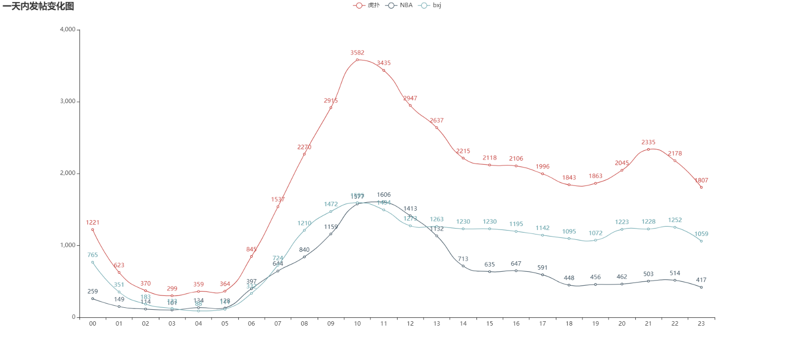

# 2019年3月-6月虎扑发帖数据分析
## 项目内容
* 抓取虎扑2019年3月16日至6月23日帖子标题、回帖数、浏览数，发布时间；并选取 **top 4.4w** 帖子抓取**亮了**的回帖内容；及相关的用户信息，包括所在地、性别、等级 、注册时间、在线时长、声望、回帖数、主题数；
* 绘制图像包括：
  1. 近三月的发帖、回帖变化，及24小时的发帖、回帖变化；
  2. 回帖数与浏览数、回帖数与主题数、注册时长与在线时长；
  3. 虎扑各板块发帖量占比、虎扑性别分布、各板块回帖占比、使用设备占比；
  4. 各地区用户平均在线时长、平均声望、平均发帖数、平均回帖数、注册年份；
  5. 发帖，回帖内容词云。
## 项目思路
1. 分析虎扑论坛页面，评价可获取数据，确定分析目标；
2. 使用 requests 或者 scrapy 抓取相应数据（本项目使用 scrapy 及 requests）, 并使用 pymongo 保存；
3. 使用可视化工具 pyecharts，对数据进行可视化处理。
4. 整理分析。
## 运行环境
* python3.7
* windows
* jupyter notebook
## 运行依赖包
* requests
* pyecharts
* pymongo
* scrapy
* jieba
* wordcloud
## 文件说明
### hupu_html
* 使用 pyecharts 生成图像的文件，具有很好的交互性，建议下载到本地查看；同时本项目考虑图表交互性，图使用 pyecharts 绘制。推荐使用 jupyter notebook 作图。
### hupu_pic
* pyecharts 图表为 html 文件，为方便在 GitHub 上查看部分效果，此文件夹为**hupu_html**中图像的展示及发帖、回帖内容词云。
### code
* **hupu** 文件夹中为本次使用的 scrapy 项目文件，包括抓取用户信息，及详细帖子的代码；
* plates_list.py 爬取各板块发帖列表的基础信息；
* pyecharts_hupu.ipynb jupyter notebook 文件包括 **hupu_html** 文件夹中文件的生成代码。
## 一些代码说明及建议
### 如何跑起来
1. 在你想要放置本项目的文件夹下使用

        git clone https://github.com/spiderbeg/hupu_data.git
    
将本项目复制文件夹中。

2. 首先运行爬虫代码 **plates_list.py**, 代码中的 classfy 表文件，我将以 json 序列化文件提供；板块信息抓取完毕，接下来根据标准选择自己需求范围的数据，本次项目需求是 抓取回帖 200 以上或浏览 5w 以上的帖子进行分析；代码如下：

        import pymongo
        def get_ready(ch='plates',dbname='hupu'):
            '''数据库调用'''
            global mycol, myclient,myhp
            myclient = pymongo.MongoClient("mongodb://localhost:27017/")
            mydb = myclient[dbname]
            mycol = mydb[ch]
            myhp = mydb['posts_list']
        get_ready()
        ss = mycol.find({})
        reply = [0]
        r,v = 0,0
        for i,s in enumerate(ss): 
            if int(s['reply'])>=200 or int(s['view'])>=50000:
                s.pop('_id')
                myhp.insert_one(s)
            
3. 进入 code 文件夹下 **hupu** 的 scrapy 项目。

        scrapy crawl hupu_p_c 
    
这就是抓取帖子详细内容的爬虫。

    scrapy crawl user
    
这是抓取用户信息的代码。
4. 绘图代码，放在 code 的 **pyecharts_hupu.ipynb**；
这样整个项目就跑了起来。
### 对于如何跑起来中有疑问的地方，这里回答
* 导入json格式文件数据： mongoimport -d <数据库名称> -c <collection名称> --file <要导入的json文件名称>
* 如何安装 git 见 <https://mp.weixin.qq.com/mp/appmsg/show?__biz=MjM5MDEyMDk4Mw==&appmsgid=10000361&itemidx=1&sign=f88b420f70c30c106697f54f00cf2a95>；
* MongoDB 安装：<http://mongoing.com/archives/25650> ；使用：<https://juejin.im/post/5addbd0e518825671f2f62ee>;
* 不熟悉 scrapy 的瞧一眼这里：<https://cuiqingcai.com/3472.html>;
### 建议
* 考虑绘制图表的交互性，推荐使用 pyecharts <https://pyecharts.org/>；
## 部分图片展示（更多图片见 hupu_html 及 hupu_pic 文件）
* 虎扑各板块发帖占比图
 
* 虎扑性别占比图
 
* 虎扑24小时发帖变化图
 
* 虎扑声望前50图
 
* 虎扑各地区用户平均声望图
 
* 虎扑回帖词云
 
