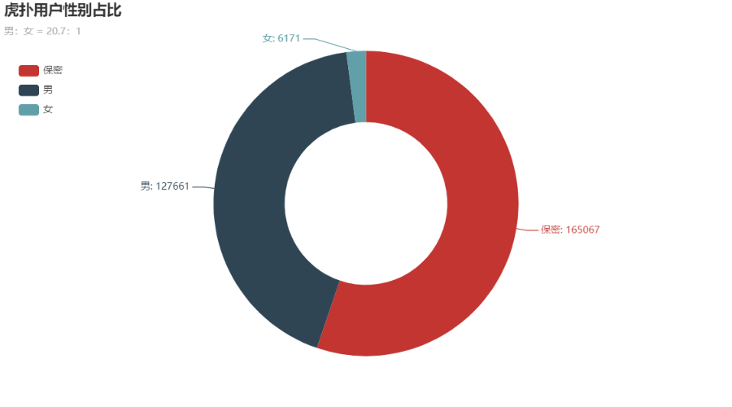

# 2019年3月-6月虎扑发帖数据分析
## 项目内容
* 抓取虎扑2019年3月16日至6月23日帖子标题、回帖数、浏览数，发布时间；并选取 **top 4.4w** 帖子抓取**亮了**的回帖内容；及相关的用户信息，包括所在地、性别、等级 、注册时间、在线时长、声望、回帖数、主题数；
* 绘制图像包括：
  1. 近三月的发帖、回帖变化，及24小时的发帖、回帖变化；
  2. 回帖数与浏览数、回帖数与主题数、注册时长与在线时长；
  3. 虎扑各板块发帖量占比、虎扑性别分布、各板块回帖占比、使用设备占比；
  4. 各地区用户平均在线时长、平均声望、平均发帖数、平均回帖数、注册年份；
  5. 发帖，回帖内容词云。
## 项目思路
1. 分析虎扑论坛页面，评价可获取数据，确定分析目标；
2. 使用 requests 或者 scrapy 抓取相应数据（本项目使用 scrapy 及 requests）, 并使用 pymongo 保存；
3. 使用可视化工具 pyecharts，对数据进行可视化处理。
4. 整理分析。
## 运行环境
* python3.7
* windows
* jupyter notebook
## 运行依赖包
* requests
* pyecharts
* pymongo
* scrapy
* jieba
* wordcloud
## 文件说明
### hupu_html
* 使用 pyecharts 生成图像的文件，具有很好的交互性，建议下载到本地查看；同时本项目考虑图表交互性，图使用 pyecharts 绘制。推荐使用 jupyter notebook 作图。
### hupu_pic
* pyecharts 图表为 html 文件，为方便在 GitHub 上查看部分效果，此文件夹为**hupu_html**中图像的展示及发帖、回帖内容词云。
### code
* **hupu** 文件夹中为本次使用的 scrapy 项目文件，包括抓取用户信息，及详细帖子的代码；
* plates_list.py 爬取各板块发帖列表的基础信息；
* pyecharts_hupu.ipynb jupyter notebook 文件包括 **hupu_html** 文件夹中文件的生成代码。
## 一些建议
* 考虑绘制图表的交互性，推荐使用 pyecharts <https://pyecharts.org/>；
## 部分图片展示（更多图片见 hupu_html 及 hupu_pic 文件）
* 虎扑各板块发帖占比图
 
* 虎扑性别占比图
 
* 虎扑24小时发帖变化图
 
* 虎扑声望前50图
 
* 虎扑各地区用户平均声望图
 
* 虎扑回帖词云
 
